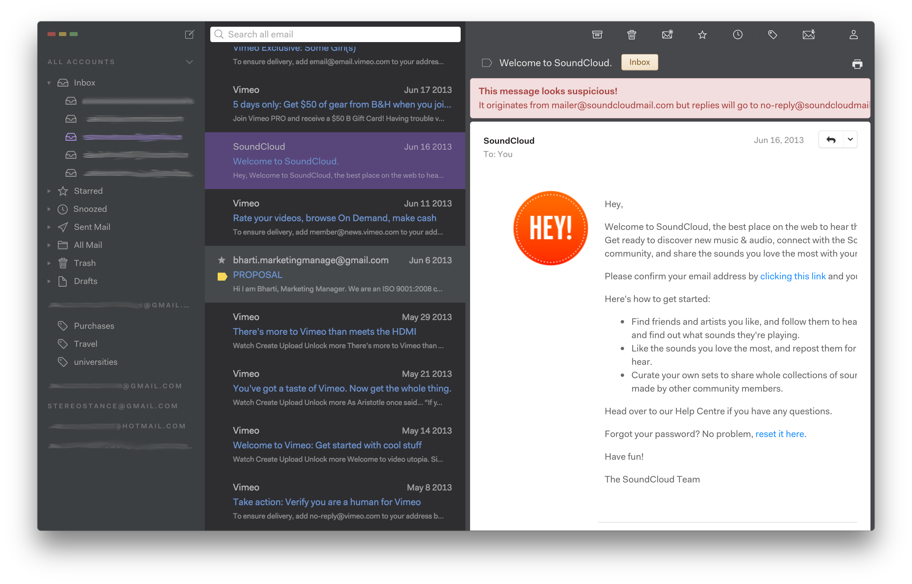
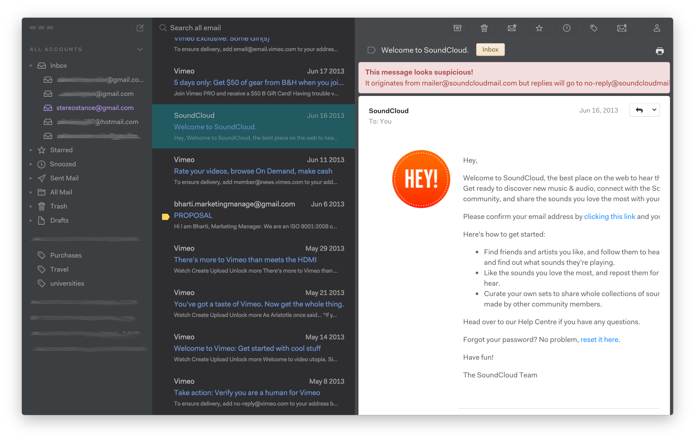
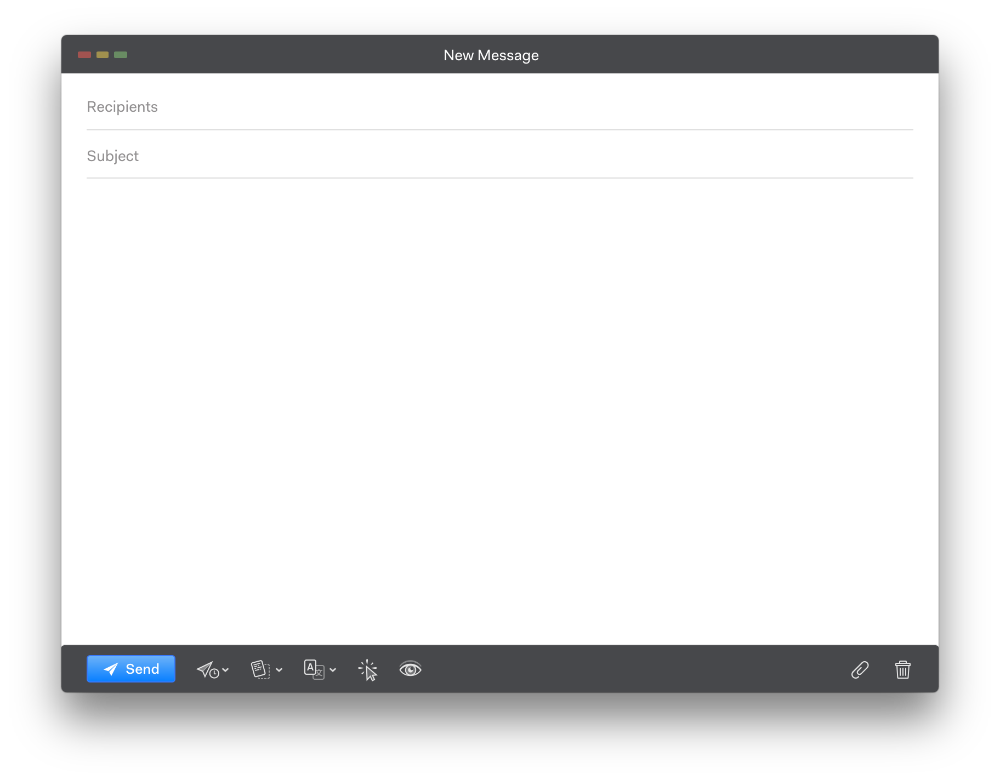

# 80's Baby theme
`v3.0.0`

A fork of the customizable, dark sidebar theme for ~~[Nylas N1](https://nylas.com/n1)~~ [Mailspring](https://github.com/Foundry376/Mailspring).
Made to match [Bracket's 80's Baby theme](https://github.com/Brackets-Themes/80sBaby).

[See other example themes →](http://jamiewilson.io/darkside)

## Installation

### Step 1: Download

#### Option 1: via the command line  
`git clone https://github.com/Porco-Rosso/N1-80s-Baby-Theme.git ~/Library/Application\ Support/Mailspring/packages/80sBaby`

#### Option 2: the ZIP archive  
[[Download 80sBaby]](https://github.com/Porco-Rosso/N1-80s-Baby-Theme/archive/master.zip)

Then, unzip `80sBaby-master.zip`.

### Step 2: Install
Open the toolbar and select `Mailspring > Install Theme...`

### Step 3: Activate
Select the `80sBaby-master` folder and press `Open`. N1 will make a copy of the theme files into your `~/Library/Application\ Support/Mailspring/packages/` directory and notify you that the theme has been installed.

### Step 3: Customize
To customize 80sBaby, open `80sBaby-master/styles/80sBaby.less` in a text editor.

**To change colors, just comment out the default `@sidebar` and `@accent` variables and uncomment another theme or simply replace with your own colors.**

 
 
 
 
 
 
 

### Feedback
If you have questions or suggestions, please add an issue.
